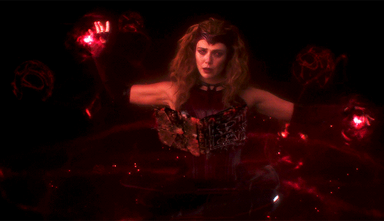

  

 

   🧬 Applied Bioinformatics 🧬 | 👩🏻‍💻 Software Engineer & Full-Stack Developer 👩🏻‍💻 |  ⚡ Tech Mentor and Advocate ⚡

 

   &nbsp;
   &nbsp;
   &nbsp;
  

 

 

 

  

 

  

 
 

  

    

      
      
    

    

      
    

  

 

 

 

